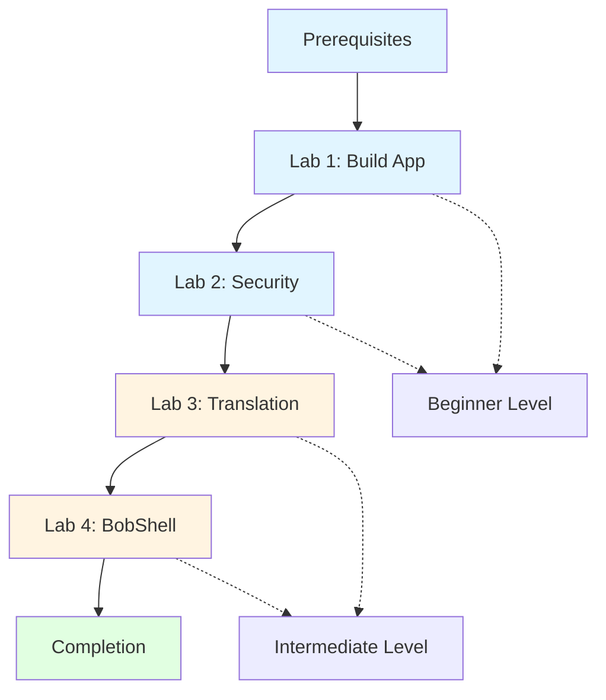

# Bob Bootcamp: Hands-On Labs

Welcome to the Bob Bootcamp hands-on labs! This comprehensive training series will teach you how to leverage IBM Bob's AI-powered development capabilities through practical, real-world exercises.


## 🎯 Overview

These labs are designed to give you hands-on experience with Bob's core features through four progressive exercises:

1. **Lab 1: Building Applications** - Create a full-stack todo application
2. **Lab 2: Security & Code Analysis** - Identify and fix security vulnerabilities
3. **Lab 3: Code Translation** - Translate Python code to JavaScript
4. **Lab 4: BobShell & CLI** - Master command-line automation

**Total Learning Time**: ~3 hours

## 🚀 What You'll Learn

### Bob's Core Features
- **Multiple Modes**: Plan, Code, and Ask modes for different tasks
- **Auto-approvals**: Rapid development with automated confirmations
- **Literate Coding**: Self-documenting code with inline explanations
- **MCP Servers**: Integration with GitHub and custom services
- **BobShell**: Command-line interface and automation
- **Code Analysis**: Understanding and improving existing codebases
- **Security Awareness**: Identifying and fixing vulnerabilities
- **Code Translation**: Converting code between languages

### Technical Skills
- Full-stack web development (Python Flask + JavaScript)
- REST API design and implementation
- Security best practices (SQL injection, XSS, secrets management)
- Cross-language development patterns
- Command-line automation and scripting
- CI/CD integration

## 📋 Prerequisites

Before starting these labs, ensure you have:

### Required Software
- **Python 3.8+** - [Download](https://www.python.org/downloads/)
- **Node.js 14+** - [Download](https://nodejs.org/)
- **Git 2.x+** - [Download](https://git-scm.com/)
- **Bob** - Installed and configured
- **Text Editor/IDE** - VS Code recommended

### Required Knowledge
- Basic Python syntax and concepts
- Basic JavaScript syntax and concepts
- HTML/CSS fundamentals
- REST API concepts
- Git basics
- Command line usage

### Account Setup
- GitHub account (for Lab 1)
- Bob account configured
- GitHub MCP server connected (optional but recommended)

For detailed setup instructions, see [prerequisites.md](prerequisites.md).

## 📚 Lab Structure

### 🟢 Beginner Track (Labs 1-2)

#### Lab 1: Building a Todo Application (45 minutes)
**Focus**: Creation and Development

Learn to use Bob's different modes to build a complete full-stack application from scratch.

**What You'll Build**:
- Python Flask REST API backend
- JavaScript frontend with modern UI
- SQLite database integration
- GitHub repository with version control

**Bob Features**:
- ✅ Plan Mode for planning
- ✅ Code Mode for implementation
- ✅ Auto-approvals for rapid development
- ✅ Literate coding for documentation
- ✅ GitHub MCP for version control

**[Start Lab 1 →](lab1/README.md)**

---

#### Lab 2: Security Analysis & Fixes (45 minutes)
**Focus**: Code Analysis and Security

Use Bob to analyze existing code, identify security vulnerabilities, and implement fixes.

**What You'll Analyze**:
- SQL injection vulnerabilities
- Cross-site scripting (XSS) issues
- Hardcoded secrets and credentials
- Input validation problems

**Bob Features**:
- ✅ Ask Mode for code understanding
- ✅ Plan Mode for analysis and planning
- ✅ Code Mode for implementing fixes
- ✅ Multi-file code analysis
- ✅ Security best practices

**[Start Lab 2 →](lab2/README.md)**

---

### 🟡 Intermediate Track (Labs 3-4)

#### Lab 3: Code Translation (45 minutes)
**Focus**: Cross-Language Development

Learn to translate code between languages while maintaining functionality and best practices.

**What You'll Translate**:
- Python data processing script
- File I/O operations
- Statistical calculations
- JSON export functionality

**Bob Features**:
- ✅ Ask Mode for code analysis
- ✅ Plan Mode for translation planning
- ✅ Code Mode for implementation
- ✅ Language-specific patterns
- ✅ Documentation maintenance

**[Start Lab 3 →](lab3/README.md)**

---

#### Lab 4: BobShell & Command Line (45 minutes)
**Focus**: Automation and CLI

Master Bob's command-line interface for automation and integration into development workflows.

**What You'll Learn**:
- BobShell command syntax
- File operations from CLI
- Batch processing
- CI/CD integration
- Automation scripts

**Bob Features**:
- ✅ BobShell commands
- ✅ CLI automation
- ✅ Scripting capabilities
- ✅ Pipeline integration
- ✅ Workflow optimization

**[Start Lab 4 →](lab4/README.md)**


---

## 🗺️ Learning Path



### Recommended Progression
1. **Complete prerequisites** - Ensure all software is installed
2. **Labs 1-2 (Beginner)** - Build foundational understanding
3. **Labs 3-4 (Intermediate)** - Expand your skills
4. **Review and practice** - Apply to your own projects

### Time Commitment
- **Lab 1**: 45 minutes
- **Lab 2**: 45 minutes
- **Lab 3**: 45 minutes
- **Lab 4**: 45 minutes
- **Total**: ~3 hours (including breaks)

## 📖 Additional Resources

### Documentation
- [Prerequisites & Setup](prerequisites.md) - Detailed setup instructions
- [Architecture Overview](ARCHITECTURE.md) - Technical architecture details
- [Detailed Plan](DETAILED_PLAN.md) - Complete implementation guide
- [Visual Overview](LAB_OVERVIEW.md) - Diagrams and visual guides
- [New Labs Plan](NEW_LABS_PLAN.md) - Labs 4-6 planning document

### Reference Guides
- [Bob Features Guide](resources/bob-features-guide.md) - Quick reference
- [MCP Servers Guide](resources/mcp-servers-guide.md) - MCP integration
- [Troubleshooting](resources/troubleshooting.md) - Common issues

### Support
- Bob Documentation - Official docs
- Community Forum - Ask questions
- GitHub Issues - Report problems

## ✅ Success Criteria

You'll know you've successfully completed the bootcamp when you can:

### After Labs 1-2 (Beginner)
- [ ] Switch confidently between Bob's different modes
- [ ] Use auto-approvals effectively for rapid development
- [ ] Apply literate coding principles to your code
- [ ] Integrate GitHub MCP for version control
- [ ] Identify common security vulnerabilities
- [ ] Implement security fixes properly

### After Labs 3-4 (Intermediate)
- [ ] Translate code between languages
- [ ] Use BobShell for automation
- [ ] Create CI/CD integrations
- [ ] Script repetitive development tasks
- [ ] Apply Bob to your own projects

## 🎓 What's Next?

After completing these labs, you can:

1. **Apply to Real Projects**: Use Bob on your own development work
2. **Explore Advanced Features**: Dive deeper into Bob's capabilities
3. **Join the Community**: Share your experience and help others
4. **Build Your Portfolio**: Showcase your Bob-powered projects
5. **Continue Learning**: Explore additional MCP servers and integrations
6. **Contribute**: Help improve Bob and its ecosystem

## 🤝 Contributing

Found an issue or have a suggestion? We welcome contributions!

- Report bugs via GitHub Issues
- Submit improvements via Pull Requests
- Share feedback in the Community Forum
- Help other learners in discussions

## 📝 License

This educational content is provided for learning purposes. Please refer to the LICENSE file for details.

## 🙏 Acknowledgments

Created with ❤️ using Bob to demonstrate Bob's capabilities.

Special thanks to the Bob development team and the community for their support.

---

## Quick Start

Ready to begin? Here's how to get started:

1. **Verify Prerequisites**
   ```bash
   python --version    # Should be 3.8+
   node --version      # Should be 14+
   git --version       # Should be 2.x+
   ```

2. **Clone or Download**
   ```bash
   git clone <repository-url>
   cd bootcamp_intro_lab
   ```

3. **Start Lab 1**
   ```bash
   cd lab1
   # Follow instructions in lab1/README.md
   ```

4. **Get Help**
   - Check the troubleshooting guide
   - Use Bob's Ask mode for questions
   - Review the documentation

---

## Lab Completion Tracking

Track your progress through the bootcamp:

- [ ] Lab 1: Building Applications ✅
- [ ] Lab 2: Security Analysis ✅
- [ ] Lab 3: Code Translation ✅
- [ ] Lab 4: BobShell & CLI ✅

**Legend**: ✅ Complete | 🚧 In Progress | ⬜ Not Started

**All labs are now complete and ready for use!**

---

**Ready to start your Bob journey? [Begin with Lab 1 →](lab1/README.md)**

---

*Last Updated: March 2026*
*Version: 1.0 - Core Series (Labs 1-4)*